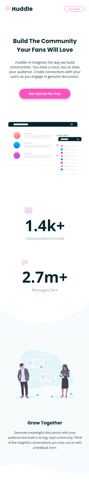
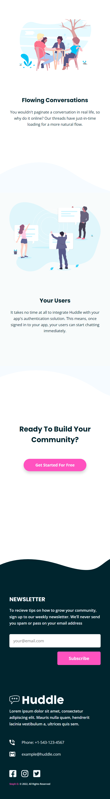

# Frontend Mentor - Huddle landing page with curved sections solution

**Live Site URL** - ***https://stephorc.github.io/huddle-landing-curved/***

This is my solution to the [Huddle landing page with curved sections challenge on Frontend Mentor](https://www.frontendmentor.io/challenges/huddle-landing-page-with-curved-sections-5ca5ecd01e82137ec91a50f2). Frontend Mentor challenges help you improve your coding skills by building realistic projects.

  
  

<!--  -->
<!-- 
 -->

## The challenge

Users should be able to:

- View the optimal layout for the site depending on their device's screen size
- See hover states for all interactive elements on the page

## Built with

- Semantic HTML5 markup
- CSS custom properties
- Flexbox
- Mobile-first workflow

## Features

- Responsive sizing
- Clean UI

## Useful resources

- [Sitepoint Community](https://www.sitepoint.com/community/t/centering-image-inside-flexbox/287444/5) - This site helped me to center a few unruly flexed items.
- [angel-rs](https://angel-rs.github.io/css-color-filter-generator/) - I love this repo. I use it all the time to convert colors, when necessary.